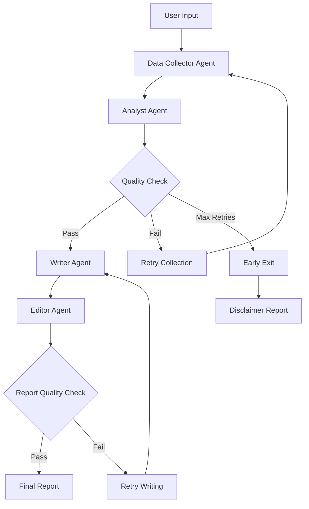

# 🤖 AI Financial Report Generator - Production API

> **Live Production API**: https://financial-report-generator-production.up.railway.app

<div align="center">

An intelligent multi-user AI application that generates comprehensive financial analysis reports using LangGraph workflows and real-time web search.

[](https://python.org)
[](https://fastapi.tiangolo.com)
[](https://postgresql.org)
[](https://railway.app)

</div>

---

## 🎯 What It Does

This production-ready application automatically generates financial analysis reports for any public company by:

- **Web Searching** for current financial data (Tavily API)
- **AI Analysis** using multi-agent workflows (LangGraph + Groq/Llama 3.3)
- **Report Generation** with structured insights and citations
- **Multi-User Support** with authentication and background processing

### Key Features

✅ **Production Deployment** - Live on Railway with PostgreSQL  
✅ **Multi-User Architecture** - JWT authentication, user-specific API keys  
✅ **Background Processing** - Asynchronous report generation (no blocking)  
✅ **Status Polling** - Real-time status updates for long-running operations  
✅ **Thread-Safe** - Factory pattern for concurrent user requests  
✅ **RESTful API** - Complete API with Swagger documentation

---

## 🏗️ Architecture

```
┌─────────────────────────────────────────────────────┐
│              FastAPI Backend (Railway)              │
│  ┌───────────────────────────────────────────────┐  │
│  │  Authentication (JWT)                         │  │
│  │  User API Key Management                      │  │
│  │  Background Task Processing                   │  │
│  └───────────────────────────────────────────────┘  │
└──────────────────┬──────────────────────────────────┘
                   │
     ┌─────────────┼─────────────┐
     │             │             │
     ▼             ▼             ▼
┌──────────┐  ┌───────────┐  ┌──────────┐
│PostgreSQL│  │ LangGraph │  │Web Search│
│ Database │  │Multi-Agent│  │ (Tavily) │
│ (Users,  │  │ Workflow  │  │   API    │
│ Reports) │  │           │  │          │
└──────────┘  └───────────┘  └──────────┘
```

**Agent Workflow**



### Agents handling differnt tasks

| Agent               | Temperature | Purpose                                                 |
| ------------------- | ----------- | ------------------------------------------------------- |
| **Data Collector**  | 0.1         | Searches web, generates queries, collects data          |
| **Analyst**         | 0.3         | Extracts metrics, identifies trends, generates insights |
| **Writer**          | 0.5         | Creates structured report with professional tone        |
| **Editor**          | 0.2         | Polishes grammar, formatting, and consistency           |
| **Quality Checker** | -           | Validates outputs and triggers retries                  |

---

## 🚀 Live Demo

### API Endpoints

**Base URL**: `https://financial-report-generator-production.up.railway.app`

#### Authentication

```bash
# Register
POST /auth/register
Body: {"email": "user@example.com", "username": "user", "password": "password123"}

# Login
POST /auth/login
Body: {"email": "user@example.com", "password": "password123"}
Returns: {"access_token": "eyJ...", "token_type": "bearer"}

# Set API Keys
PUT /auth/api-keys
Headers: Authorization: Bearer <token>
Body: {"groq_api_key": "gsk_...", "tavily_api_key": "tvly-..."}
```

#### Report Generation

```bash
# Generate Report (Returns immediately with status=pending)
POST /reports/generate
Headers: Authorization: Bearer <token>
Body: {"company_name": "Tesla"}
Returns: {"id": 1, "status": "pending", "company_name": "Tesla"}

# Check Status
GET /reports/1
Headers: Authorization: Bearer <token>
Returns: {"id": 1, "status": "success", "report_content": "# Financial Analysis..."}

# Get All Reports
GET /reports/
Headers: Authorization: Bearer <token>
```

### Try It Now

**Interactive API Documentation**: https://financial-report-generator-production.up.railway.app/docs

---

## 💻 Tech Stack

### Backend

- **FastAPI** - Modern async web framework
- **PostgreSQL** - User data and report storage
- **SQLAlchemy** - ORM for database operations
- **Pydantic** - Data validation and settings
- **JWT** - Token-based authentication

### AI/ML

- **LangGraph** - Multi-agent workflow orchestration
- **LangChain** - LLM application framework
- **Groq API** - Ultra-fast LLM inference (Llama 3.3 70B)
- **Tavily API** - Real-time web search

### Infrastructure

- **Railway** - Cloud deployment platform
- **Docker** - Containerization (implicit via Railway)
- **Background Tasks** - FastAPI BackgroundTasks for async processing

---

## 📊 Example Output

```markdown
# Financial Analysis Report

**Company:** Tesla
**Generated:** 2024-12-22
**Status:** Complete

## Executive Summary

Tesla demonstrated strong financial performance in 2024 with revenue
reaching $97.69B and profit of $1.13B. The company's growth rate was
modest at 0.95%...

## Key Metrics

- **Revenue**: $97.69B
- **Net Income**: $1.13B
- **Growth Rate**: 0.95%

[Full report with 6 sections including market analysis, competitive
landscape, and strategic observations]
```

---

## 🔧 Local Development Setup

### Prerequisites

- Python 3.11+
- PostgreSQL 14+
- API Keys: [Groq](https://console.groq.com/), [Tavily](https://tavily.com/)

### Installation

```bash
# Clone repository
git clone https://github.com/its-me-koustubhya/financial-report-generator.git
cd financial-report-generator

# Create virtual environment
python -m venv venv
source venv/bin/activate  # Windows: venv\Scripts\activate

# Install dependencies
pip install -r requirements.txt

# Set up environment variables
cp .env.example .env
# Edit .env with your DATABASE_URL, SECRET_KEY, GROQ_API_KEY, TAVILY_API_KEY

# Initialize database
python -c "from database.init_db import init_database; init_database()"

# Run server
uvicorn main_api:app --reload
```

Visit: `http://localhost:8000/docs`

---

## 🧪 Testing

```bash
# Health check
curl https://financial-report-generator-production.up.railway.app/health

# Full workflow test (requires auth)
python test_background.py
```

---

## 📁 Project Structure

```
financial-report-generator/
├── main_api.py              # FastAPI application entry point
├── config.py                # Pydantic settings with validation
├── Procfile                 # Railway deployment config
├── railway.json             # Railway build configuration
├── requirements.txt         # Python dependencies
├── database/
│   ├── models.py            # SQLAlchemy models (User, Report)
│   ├── connection.py        # Database session management
│   └── init_db.py           # Database initialization
├── auth/
│   ├── routes.py            # Auth endpoints
│   ├── utils.py             # JWT, password hashing
│   ├── schemas.py           # Pydantic models
│   └── dependencies.py      # Auth middleware
├── reports/
│   └── routes.py            # Report CRUD + generation
├── agents/
│   ├── data_collector.py    # Web search agent
│   ├── analyst.py           # Analysis agent
│   ├── writer.py            # Report writer
│   └── editor.py            # Editing agent
└── graph/
    └── workflow.py          # LangGraph orchestration
```

---

## 🎓 Technical Highlights

### 1. Thread-Safe API Key Management

- **Factory Pattern** for LLM instantiation
- User-specific API keys passed through workflow
- No shared global state

### 2. Background Processing

- `BackgroundTasks` for async report generation
- Status polling pattern (industry standard)
- Non-blocking user experience

### 3. Multi-User Architecture

- JWT authentication with expiry
- User data isolation via foreign keys
- Concurrent request handling

### 4. Production Best Practices

- Pydantic Settings for config validation
- Proper error handling and logging
- Database connection pooling
- Environment-based configuration

---

## 🚧 Future Enhancements

- [ ] Rate limiting per user
- [ ] Report caching for duplicate requests
- [ ] Email notifications on completion
- [ ] Export to PDF
- [ ] Frontend dashboard (React/Streamlit)
- [ ] WebSocket for real-time updates
- [ ] Cost tracking per user

---

## 👤 Author

**Koustubhya Singh**  
Aspiring Data Analyst & Python Developer

- GitHub: [@its-me-koustubhya](https://github.com/its-me-koustubhya)
- LinkedIn: [koustubhya-singh](https://linkedin.com/in/koustubhya-singh)
- Email: singh10api@gmail.com

---

<div align="center">

**⭐ If you found this helpful, please star the repo!**

**Built with FastAPI, LangGraph, PostgreSQL, and deployed on Railway**

</div>
