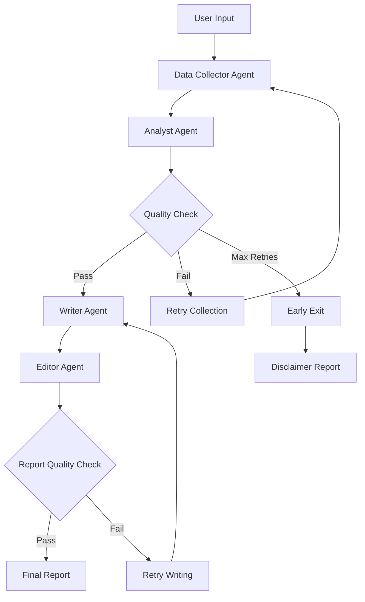

# 🤖 AI Business Report Generator

<div align="center">


**An intelligent multi-agent system that generates comprehensive financial analysis reports using LangGraph and Large Language Models.**

[Features](#-features) • [Demo](#-demo) • [Installation](#-installation) • [Usage](#-usage) • [Architecture](#-architecture) • [Documentation](#-documentation)

</div>

---

## 📋 Table of Contents

- [Overview](#-overview)
- [Features](#-features)
- [Demo](#-demo)
- [Architecture](#-architecture)
- [Installation](#-installation)
- [Usage](#-usage)
- [Configuration](#-configuration)
- [Project Structure](#-project-structure)
- [How It Works](#-how-it-works)
- [Examples](#-examples)
- [Troubleshooting](#-troubleshooting)
- [Contributing](#-contributing)
- [License](#-license)
- [Acknowledgments](#-acknowledgments)

---

## 🎯 Overview

The **AI Business Report Generator** is a sophisticated multi-agent system that autonomously researches, analyzes, and generates professional financial analysis reports for any public company. Built with LangGraph and powered by state-of-the-art LLMs, it demonstrates advanced AI engineering concepts including agent orchestration, conditional routing, and quality validation.

### Why This Project?

- 🤖 **Learn Multi-Agent Systems**: Understand how specialized AI agents collaborate
- 🔄 **Master LangGraph**: Implement complex workflows with conditional logic
- 📊 **Real-World Application**: Generate actual financial reports for companies
- 🎓 **Production-Ready Code**: Enterprise-grade error handling and validation

---

## ✨ Features

### Core Capabilities

- **🔍 Intelligent Data Collection**: Automatically searches and collects financial data from multiple web sources
- **📊 Advanced Analysis**: Extracts key metrics, identifies trends, and generates insights
- **✍️ Professional Writing**: Creates comprehensive reports with proper structure and formatting
- **🎨 Smart Editing**: Polishes grammar, formatting, and ensures consistency

### Advanced Features

- **🔄 Self-Correcting Workflows**: Automatically retries with enhanced strategies when quality is insufficient
- **✅ Quality Validation**: Multi-stage checks ensure high-quality outputs
- **⚡ Early Exit Strategy**: Efficiently handles edge cases without wasting resources
- **🎯 Conditional Routing**: Dynamic decision-making based on data quality
- **📁 Automatic Saving**: Reports saved with timestamps and proper naming
- **🖥️ CLI Interface**: User-friendly command-line tool with multiple options

---

## 🎬 Demo

### Basic Usage

```bash
$ python main.py "Tesla"

======================================================================
🚀 Business Report Generator
======================================================================
📊 Company: Tesla
======================================================================

✅ QUALITY CHECK PASSED - Analysis quality is sufficient
   - Known metrics: 3/3
   - Insights: 6
   - Trends: 4
   - Raw data: 30 chunks (28,221 chars)

✅ QUALITY CHECK PASSED - Report meets quality standards
   - Length: 8,723 characters
   - All sections present

💾 Report saved to: output/Tesla_report_20241119_092023.md

======================================================================
✅ Workflow Completed!
======================================================================
```

### Sample Output Structure

```markdown
# Financial Analysis Report

**Company:** Tesla
**Generated:** 2024-11-19
**Status:** Complete

## Executive Summary

Tesla demonstrated strong financial performance...

## Company Overview

Tesla, Inc. is a leading electric vehicle manufacturer...

## Financial Performance Analysis

[Detailed metrics and analysis]

## Market Position & Competitive Landscape

[Market analysis and trends]

## Key Insights & Strategic Observations

[Critical insights and implications]

## Conclusion

[Summary and forward-looking perspective]
```

---

## 🏗️ Architecture

### Multi-Agent System Design



### Agent Roles

| Agent               | Temperature | Purpose                                                 |
| ------------------- | ----------- | ------------------------------------------------------- |
| **Data Collector**  | 0.1         | Searches web, generates queries, collects data          |
| **Analyst**         | 0.3         | Extracts metrics, identifies trends, generates insights |
| **Writer**          | 0.5         | Creates structured report with professional tone        |
| **Editor**          | 0.2         | Polishes grammar, formatting, and consistency           |
| **Quality Checker** | -           | Validates outputs and triggers retries                  |

---

## 🚀 Installation

### Prerequisites

- Python 3.11 or higher
- pip package manager
- API keys for:
  - [Groq](https://console.groq.com/) (LLM provider)
  - [Tavily](https://tavily.com/) (Web search)

### Step 1: Clone Repository

```bash
git clone https://github.com/its-me-koustubhya/business-report-generator.git
cd business-report-generator
```

### Step 2: Create Virtual Environment

```bash
# Create virtual environment
python -m venv venv

# Activate (Windows)
venv\Scripts\activate

# Activate (macOS/Linux)
source venv/bin/activate
```

### Step 3: Install Dependencies

```bash
pip install -r requirements.txt
```

### Step 4: Configure Environment

Create a `.env` file in the root directory:

```env
# API Keys
GROQ_API_KEY=your_groq_api_key_here
TAVILY_API_KEY=your_tavily_api_key_here

# Model Configuration
MODEL_NAME=llama-3.3-70b-versatile
```

### Step 5: Verify Installation

```bash
python main.py "Tesla" --no-save
```

---

## 💻 Usage

### Command Line Interface

```bash
python main.py <company_name> [OPTIONS]
```

### Options

| Option      | Description                        | Default   |
| ----------- | ---------------------------------- | --------- |
| `company`   | Company name to analyze (required) | -         |
| `--focus`   | Specific analysis focus            | None      |
| `--output`  | Output directory for reports       | `output/` |
| `--no-save` | Don't save report to file          | False     |
| `--quiet`   | Suppress progress messages         | False     |
| `--help`    | Show help message                  | -         |

### Examples

#### Basic Report Generation

```bash
python main.py "Tesla"
```

#### With Specific Focus

```bash
python main.py "Apple Inc" --focus "Q4 2024 earnings performance"
```

#### Custom Output Directory

```bash
python main.py "Microsoft" --output reports/2024/
```

#### Silent Mode (No Progress Messages)

```bash
python main.py "Amazon" --quiet
```

#### Display Only (Don't Save)

```bash
python main.py "Google" --no-save
```

### Batch Processing

Generate reports for multiple companies:

```bash
python batch_generate.py
```

Edit `batch_generate.py` to customize the company list:

```python
companies = [
    "Tesla",
    "Apple Inc",
    "Microsoft",
    "Amazon",
    "Google"
]
```

---

## ⚙️ Configuration

### Model Settings

Edit `config.py` to customize:

```python
# LLM Models
MODEL_NAME = "llama-3.3-70b-versatile"

# Temperature Settings
MIN_TEMPERATURE = 0.0
MAX_TEMPERATURE = 2.0
DEFAULT_TEMPERATURE = 0.7

# Report Configuration
OUTPUT_FORMAT = "markdown"
MAX_REPORT_LENGTH = 5000
MIN_SOURCES = 3
```

### Quality Thresholds

Edit `agents/quality_checker.py`:

```python
# Minimum requirements for analysis
MIN_INSIGHTS = 3
MIN_TRENDS = 3
MIN_DATA_CHUNKS = 5
MIN_DATA_CHARS = 2000

# Minimum requirements for report
MIN_REPORT_LENGTH = 3000
MIN_COMPANY_MENTIONS = 10
MIN_QUANTITATIVE_METRICS = 5
```

---

## 📁 Project Structure

```
business_report_generator/
│
├── 📄 main.py                    # CLI entry point
├── 📄 batch_generate.py          # Batch processing script
├── 📄 config.py                  # Configuration and API setup
├── 📄 requirements.txt           # Python dependencies
├── 📄 README.md                  # This file
├── 📄 .env                       # Environment variables (not in git)
├── 📄 .gitignore                # Git ignore rules
│
├── 📂 agents/                    # Agent implementations
│   ├── __init__.py
│   ├── data_collector.py        # Web search and data collection
│   ├── analyst.py               # Financial analysis
│   ├── writer.py                # Report generation
│   ├── editor.py                # Editing and formatting
│   └── quality_checker.py       # Quality validation
│
├── 📂 graph/                     # LangGraph workflow
│   ├── __init__.py
│   ├── state.py                 # Shared state definition
│   └── workflow.py              # Workflow orchestration
│
├── 📂 tools/                     # Utility functions
│   ├── __init__.py
│   └── [future tools]
│
├── 📂 output/                    # Generated reports
│   └── .gitkeep
│
└── 📂 tests/                     # Test suite
    ├── __init__.py
    └── test_agents.py
```

---

## 🔧 How It Works

### 1. Data Collection Phase

```python
# Data Collector Agent
1. Generates 3 intelligent search queries
2. Searches web using Tavily API
3. Collects relevant financial data
4. Validates data relevance
```

### 2. Analysis Phase

```python
# Analyst Agent
1. Combines collected data
2. Extracts financial metrics (revenue, profit, growth)
3. Identifies key insights and trends
4. Structures findings in JSON format
```

### 3. Quality Check 1

```python
# Quality Checker
IF data_quality < threshold:
    → Retry data collection (max 2 attempts)
ELSE IF max_retries_reached:
    → Early exit with disclaimer
ELSE:
    → Proceed to writing
```

### 4. Writing Phase

```python
# Writer Agent
1. Structures report into 6 sections
2. Incorporates analysis and insights
3. Maintains professional tone
4. Generates 2000-3000 word report
```

### 5. Editing Phase

```python
# Editor Agent
1. Polishes grammar and style
2. Ensures markdown formatting
3. Adds metadata header
4. Final consistency check
```

### 6. Quality Check 2

```python
# Quality Checker
IF report_quality < threshold:
    → Retry writing (max 2 attempts)
ELSE:
    → Save and deliver final report
```

---

## 📚 Examples

### Example 1: Successful Report

**Input:**

```bash
python main.py "Tesla"
```

**Output:**

- ✅ 8,723 character comprehensive report
- ✅ 30 sources collected
- ✅ 6 insights, 4 trends identified
- ✅ All quality checks passed
- ✅ Saved to: `output/Tesla_report_20241119.md`

### Example 2: Insufficient Data (Early Exit)

**Input:**

```bash
python main.py "FakeCompany123"
```

**Output:**

- ⚠️ Quality checks failed (2 attempts)
- ⚠️ Early exit triggered
- ✅ Disclaimer report generated
- ✅ Resources saved (no unnecessary LLM calls)

### Example 3: Focused Analysis

**Input:**

```bash
python main.py "Apple Inc" --focus "iPhone revenue trends"
```

**Output:**

- ✅ Report emphasizes iPhone revenue analysis
- ✅ Additional context on product performance
- ✅ Trends specific to iPhone business

---

## 🐛 Troubleshooting

### Common Issues

#### Issue: "API Key not found"

```bash
Error: GROQ_API_KEY not found in environment variables
```

**Solution:** Check your `.env` file has the correct API keys.

#### Issue: "No data found"

```bash
⚠️ Quality issues detected: Company barely mentioned in data
```

**Solution:**

- Verify company name spelling
- Try full legal name (e.g., "Apple Inc" vs "Apple")
- Check if company has public financial data

#### Issue: Tavily timeout

```bash
Error during search: Request timed out after 60 seconds
```

**Solution:**

- Check internet connection
- Retry the request
- Tavily may be experiencing high load

### Debug Mode

Enable verbose logging:

```python
# In config.py
import logging
logging.basicConfig(level=logging.DEBUG)
```

---

## 🤝 Contributing

Contributions are welcome! Here's how:

### 1. Fork the Repository

```bash
git clone https://github.com/its-me-koustubhya/business-report-generator.git
cd business-report-generator
```

### 2. Create Feature Branch

```bash
git checkout -b feature/amazing-feature
```

### 3. Make Changes

- Follow existing code style
- Add tests for new features
- Update documentation

### 4. Commit Changes

```bash
git commit -m "Add amazing feature"
```

### 5. Push and Create PR

```bash
git push origin feature/amazing-feature
```

Then create a Pull Request on GitHub.

### Development Guidelines

- Write clear commit messages
- Add docstrings to all functions
- Include type hints
- Test with multiple companies
- Update README for new features

---

## 🙏 Acknowledgments

### Technologies Used

- **[LangGraph](https://github.com/langchain-ai/langgraph)** - Multi-agent orchestration framework
- **[LangChain](https://github.com/langchain-ai/langchain)** - LLM application framework
- **[Groq](https://groq.com/)** - Ultra-fast LLM inference
- **[Tavily](https://tavily.com/)** - AI-powered web search API
- **[Llama 3.3](https://ai.meta.com/llama/)** - Meta's open-source LLM

### Inspiration

This project was built as part of an AI Engineering learning journey, demonstrating practical applications of:

- Multi-agent systems
- Workflow orchestration
- Quality validation patterns
- Production-ready AI applications

### Learning Resources

- [LangGraph Documentation](https://langchain-ai.github.io/langgraph/)
- [LangChain Agents Guide](https://python.langchain.com/docs/modules/agents/)
- [Multi-Agent Systems](https://www.deeplearning.ai/short-courses/ai-agents-in-langgraph/)

---

## ⭐ Star History

If you find this project useful, please consider giving it a star! ⭐

---

<div align="center">

**Built with ❤️ using LangGraph and AI**

[Report Bug](https://github.com/yourusername/business-report-generator/issues) • [Request Feature](https://github.com/yourusername/business-report-generator/issues)

</div>
